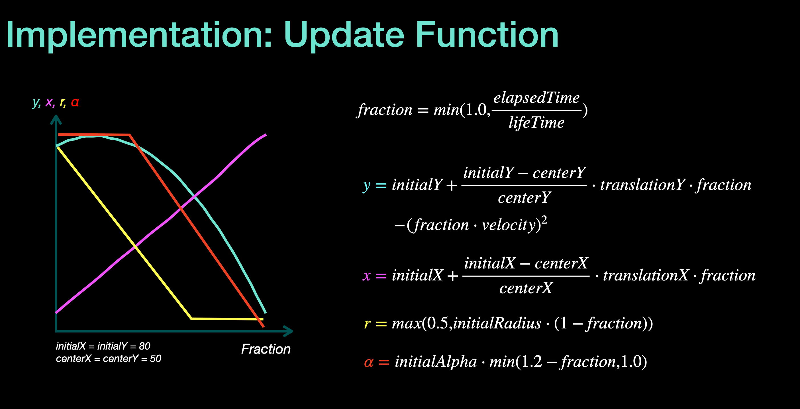

# ThanosEffect

This repository contains four modules, which implement the ThanosEffect using both **Canvas** and **OpenGL** techniques. The ThanosEffect refers to a visual effect inspired by the disintegration effect seen in popular media, where an image appears to break into particles and gradually disperse.

- **ThanosEffect-Core:** Core functionality shared by all other modules.
- **ThanosEffect-Canvas:** Implementation using Android Canvas API.
- **ThanosEffect-OpenGL:** Implementation using OpenGL ES.
- **ThanosEffect-Compose:** Bridge to use the ThanosEffect in Jetpack Compose components.

This implementation was created for Telegram Android UI contest. The implementation on the Telegram source can be found [here](https://github.com/Aghajari/Telegram-DustEffect-Implementation).


## ThanosEffect-Canvas
This module implements the ThanosEffect using the Android Canvas API. While this approach is straightforward and easy to implement, it can suffer from performance issues when handling a large number of particles.

### Usage

```kotlin
ThanosEffect.renderer = ThanosEffectCanvasRenderer

findViewById<View>(R.id.view).setOnClickListener { view ->
    ThanosEffect.start(view)
}
```

## ThanosEffect-OpenGL
This module implements the ThanosEffect using OpenGL ES, which provides better performance for rendering complex animations compared to Canvas.

### Usage

```kotlin
ThanosEffect.renderer = ThanosEffectOpenGLRenderer

findViewById<View>(R.id.view).setOnClickListener { view ->
    ThanosEffect.start(view)
}
```

## ThanosEffect-Compose
This module acts as a bridge to use the ThanosEffect in Jetpack Compose components, allowing seamless integration of the effect within modern Android UI code.

### Usage

```kotlin
@Composable
fun MainScreen() {
    val coroutineScope = rememberCoroutineScope()
    val thanosEffect = rememberThanosEffect()
    val context = LocalContext.current

    Box {
        if (thanosEffect.hasEffectStarted().not()) {
            Image(
                painter = painterResource(id = R.drawable.img),
                contentDescription = null,
                modifier = Modifier
                    .thanosEffect(thanosEffect)
                    .clickable {
                        coroutineScope.launch {
                            thanosEffect.start(context)
                        }
                    },
            )
        }
    }
}
```

## Implementation: Update Function
The update function is crucial for animating each particle in the ThanosEffect. It calculates the new position, radius, and transparency of each particle over time based on its initial properties and elapsed time.
Note that the formulas in the picture are simplified, and the actual implementation also incorporates randomness for more natural and varied animations.



## Tutorial
You can watch a detailed tutorial on how to implement the ThanosEffect here. This tutorial covers the step-by-step process, explaining both the Canvas and OpenGL implementations, and provides insights into optimizing performance and adding randomness for a more realistic effect.

By following the tutorial, you'll gain a deeper understanding of the concepts and techniques used to create complex animations.
